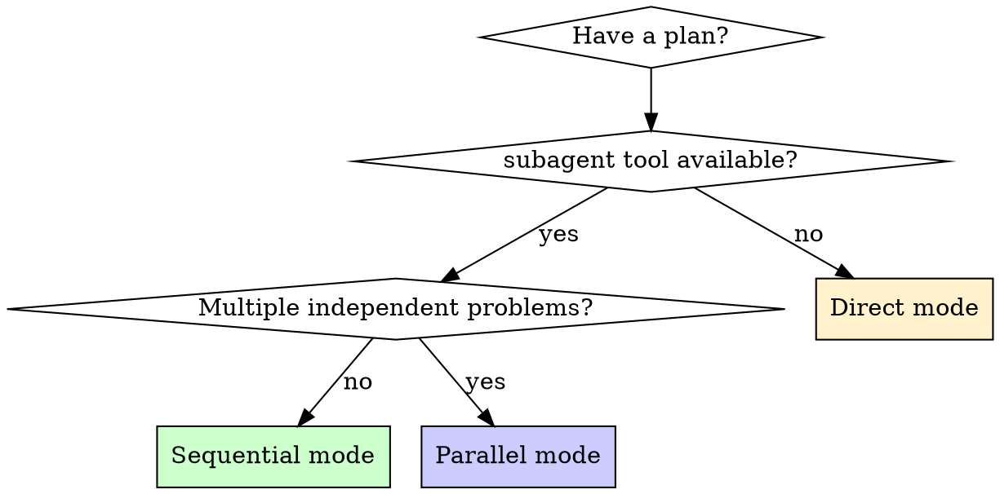

# Pi-Subagent-Driven Development

Execute implementation plans with quality gates using Pi's `subagent` tool. Requires the **PiSubagent** extension (provides the `subagent` tool, agents `scout` / `planner` / `reviewer` / `worker`, and workflow prompts).

> **Coexistence:** This skill is the Pi-native fork. The generic `subagent-driven-development` skill (Claude Code/Codex-compatible) remains untouched — do not edit that one. If `subagent` tool calls fail with "Unknown agent", PiSubagent is not installed; fall back to **Direct mode**.

## When to Use



## Mode Reference

| Mode | Call shape | Use when |
|---|---|---|
| Sequential | `subagent(agent: "worker", task: "<task text>")` — one dispatch per task | Planned implementation with review gates |
| Parallel | `subagent(tasks: [{agent, task}, ...])` — up to 8 tasks, 4 concurrent | 3+ independent problems (unrelated test files, separate subsystems) |
| Chain | `subagent(chain: [{agent, task}, ...])` — `{previous}` placeholder passes prior output | scout → plan → implement; implement → review → fix |
| Direct | (no `subagent` calls) | PiSubagent unavailable; tiny plans |

## Sequential Mode (planned implementation)

For each task in the plan:

1. **Dispatch implementer:** `subagent(agent: "worker", task: <full task text + file paths + context>)`
   - Prompt must be **self-contained**: exact file paths, the task's full text, constraints, expected output. The subagent has an isolated context — it cannot see your session.
   - Use `memory-code outline --file F` / `coding-context --symbol X` to include code context in the task text so the worker doesn't work blind.
2. **Spec review:** did the result touch only what the task specified? Accept `DONE` / `DONE_WITH_CONCERNS`; answer `NEEDS_CONTEXT` and re-dispatch; treat `BLOCKED` per its stated cause (context → re-dispatch with more info; reasoning → same agent retry is pointless, escalate).
3. **Quality review:** small diffs, tests pass, no drive-by refactors.
4. Mark task complete; advance.

**Never** dispatch two implementers over the same files concurrently.

## Parallel Mode (independent problems)

1. Group failures/problems by domain. Only parallelize when domains are truly independent (no shared files, no shared state).
2. Dispatch in one call:
   `subagent(tasks: [{agent: "worker", task: "Fix X — <error text> — constraints — return summary"}, ...])`
3. On return: read each summary, verify no conflicting edits, run the full suite, spot-check (subagents make systematic errors).

**Don't** parallelize when failures might share a root cause — investigate together first.

## Chain Workflows

`{previous}` in any step's `task` is replaced with the prior step's final assistant output. A failing step stops the chain.

Scout → Plan → Implement:
```
subagent(chain: [
  {agent: "scout",   task: "Find all code relevant to: $@. Return file paths, key symbols, architecture."},
  {agent: "planner", task: "Create an implementation plan for: $@\n\nContext from scout:\n{previous}"},
  {agent: "worker",  task: "Implement this plan verbatim:\n{previous}"}
])
```

Implement → Review → Fix:
```
subagent(chain: [
  {agent: "worker",   task: "Implement: $@"},
  {agent: "reviewer", task: "Review these changes:\n{previous}"},
  {agent: "worker",   task: "Apply this review feedback:\n{previous}"}
])
```

Ready-made presets (auto-loaded as prompt templates): `/implement`, `/scout-and-plan`, `/implement-and-review`.

## Model Selection

Use the least powerful model that can handle the role. Agent frontmatter `model:` pins it; omitting inherits your session's model + thinking level.

| Agent | Ships-with model | Rationale |
|---|---|---|
| scout | Haiku | fast recon, read-only |
| planner | Sonnet | planning quality |
| reviewer | Sonnet | review judgment |
| worker | Sonnet | implementation quality |

## Direct Mode (PiSubagent unavailable)

For executing a written plan task-by-task in this session, with the same quality discipline:

1. **Load and review plan** — read the plan file critically; raise concerns with your human partner before starting if any.
2. **Execute tasks** — mark in_progress → follow steps exactly → run verifications → self-review (matches spec? verifications pass?) → mark completed.
3. **Complete** — verify full suite, then use `finishing-a-development-branch`.

**STOP when:** a blocker hits, verification fails repeatedly, or an instruction is unclear. Ask; don't guess.

## Red Flags

- **Never** edit the generic `subagent-driven-development/SKILL.md` (it serves other harnesses).
- **Never** dispatch parallel implementers over the same files.
- **Never** send a vague task ("fix the tests") — paste error text, file paths, constraints.
- **Never** skip the spec-compliance review in Sequential mode.
- **Never** let a subagent read the plan file — paste the full task text instead.
